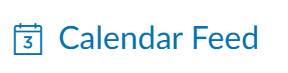
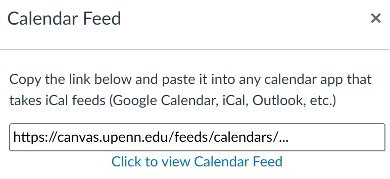

# Canvas Motion Sync
 Sync canvas tasks to Motion calendar using a custom Motion API Python bridge designed to create and update Motion events to sync one way from Canvas's calendar via an ics link. The bridge implementation preserves descriptions, locations, URLs, and deadlines. Events will be imported with MEDIUM priority and set as reminders on deadlines. Once you manually time block them in the Motion app, they will automatically start auto-scheduling.

Run this once a day or on an inteval. Suggest hooking up with cron job/Raspberry Pi server. Existing tasks will not be remade on every run unless their due dates change, in which case their due dates should update [beta]. 

## .env file structure
```
MOTION_API_KEY=[key]
CANVAS_ICAL_LINK=https://canvas.[school].edu/feeds/calendars/[something].ics
MOTION_WORKSPACE_ID=[workspace id]
```

## How to get motion API Key?
1. Create an api key here: https://app.usemotion.com/web/settings/api
2. Paste it into MOTION_API_KEY

## How to get canavas ICAL link?
1. Go to your canvas calendar.
2. On the bottom right should be an icon:

3. Copy the following URL in the textbox and paste it into the environment variable under CANVAS_ICAL_LINK


## How to get workspace ID?
1. Go to the motion app
2. Go to your default workspace or another workspace you want these events to copy over into
3. Copy the workspace ID from the url that should look like the one below
```
https://app.usemotion.com/web/pm/workspaces/[some id here to copy]/views/default
```